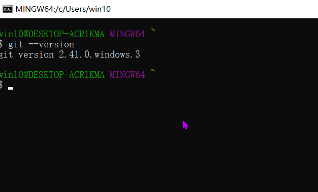
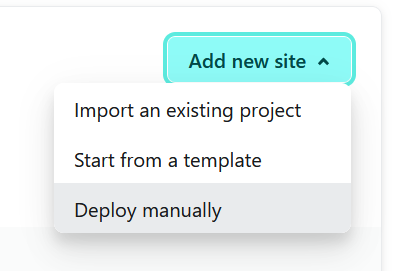

## 使用Rstudio+Hugo+GitHub+Netlify 创建个人博客网站

## **提前准备**

-   [Rstudio](https://posit.co/download/rstudio-desktop/)

-   [git](https://git-scm.com/)

-   bolgdown包下载

-   GitHub以及Netlify

### Rstudio 安装教程([转载至](https://www.xjx100.cn/news/425327.html?action=onClick)）

#### 下载[R](https://www.r-project.org/)

下载地址为：<https://cran.r-project.org>    进入链接，如下图所示，在页面顶部提供了三个下载链接，分别对应三种操作系统：Windows、Mac和Linux。请选择自己操作系统对应的链接，接下来我将以windows为例给大家展示安装过程。


接下来单击【**Download R for Windows**】------\>【**base**】------\>【**Download R 3.3.1 for Windows**】，即可下载相应安装包。


单击base，进入下面页面：


下载完R安装包（我下的按转包名称为："R-3.3.1-win.exe"），之后双击开始安装，跟一般的软件安装一样，根据需要进行相关安装设置并不断点击下一步即可。

#### 安装R

可改成自己的安装路径。


安装组件

注意：根据自身电脑操作系统的位数选择，但64位系统可全选，因为64位向下兼容32位系统。


启动选项


正在安装


安装完成并在桌面生成快捷方式

#### 

# 下载RStudio安装包

下载地址： Download RStudio \| The Popular Open-Source IDE from Posit   进入下载页面后，可以发现有Desktop和Server两个版本，我们选择Desktop。


单击蓝色圆形图标，进入跳转到Desktop版本下载窗口，Desktop版本又分为两个版本：Open Source Edition（免费）和Commercial License（付费）。

初学者自己用的话可选择前者，单击【**DOWNLOAD RSRUDIO DESKTOP**】。


单击【**DOWNLOAD RSRUDIO DESKTOP**】后进入下载页面，根据自己电脑的操作系统选择下载的版本。

#### 安装Rsudio

选择安装位置


IDE功能介绍


声明：本文转载至<https://www.xjx100.cn/news/425327.html?action=onClick>， 仅作为参考，并不用于商业用途，如有侵权，请与我联系删除。

### Git安装以及配置

#### Git下载

**安装git**([https://git-scm.com/)](https://git-scm.com/)) 

注意：选择适合自己电脑配置的版本

安装过程

下载完成后，双击.exe文件，将出现以下对话框


点击Next，默认选项和图中不一样，建议选中Git Bash here 和Git GUI here，这两个可以在任何目录下打开Git。其余的根据自己的需要进行修改即可。


继续Next，配置PATH环境


> 1.  Use Git from Git Bash only：这是最安全的选择，因为你的PATH根本不会被修改，你只能使用Git Bash的Git命令行工具。   
>
> 2.  Use Git from the Windows Command Prompt：这个选项被认为是安全的，它只向PATH添加一些最小的Git包，以避免使用可选的Unix工具混淆环境。你将能够从Git Bash和Windows命令提示符中使用Git。建议选择此项。   
>
> 3.  Use Git and optional Unix tools from the Windows Command Prompt：Git和可选的Unix工具都将添加到计算机的PATH中。警告：这将覆盖Windows工具，如"find"和"sort"，只有在了解其含义后才使用此选项。
>
> --------------- 版权声明：本文为CSDN博主「san兄弟」的原创文章，遵循CC 4.0 BY-SA版权协议，转载请附上原文出处链接及本声明。 原文链接：<https://blog.csdn.net/sanxd/article/details/82624127>

继续Next，以下选项均为默认


点击Inall开始安装，安装完成后点击Finish即可。\
在开始菜单里点击"Git "Git Bash"，弹出类似命令行的窗口，就说明Git安装成功！\
在任意目录下右击，可以看到右键菜单中有Git GUI Here和Git Bash Here两个选项。

GIt GUI 是git自带的图形化工具

Git Bash 是命令行工具

#### 

### Git 检查安装

右键点击Git Bash，在命令行中输入

```         
git --version  #version与短横线之间不存在空格
```

就会显示当前下载的 git 版本



配置用户信息

安装完 Git 后，第一件事就是设置用户名和邮箱地址。Git 需要使用这些基本信息记录对项目进行操作的用户。

右键点击Git Bash，在命令行中输入以下代码实现配置。注意如果使用了 \--global选项，则该命令只需要运行一次，就可以永久生效。

`git config --global user.name "your name" #注意为GitHub的用户名`

`git config --global user.email "your email"#GitHub注册时的邮箱地址`

[](http://www.taodudu.cc/news/show-3707188.html?action=onClick)

检查配置信息

方法一

配置完的用户名和邮箱地址会被写入C:/Users/用户名文件夹/.gitconfig 文件中。可以使用记事本查看全局的配置信息

方法二

运行终端指令

```         
# 查看所有全局配置项
git config --list --global
# 查看指定的全局配置项
git config user.name
git config user.email
```

### Git在Studio中的配置

一般来说，在Git下载完成后，系统可以自动监测到。

也可以在Rstudio的Tools-------\>global options -------\>GIT/SVN 进行设置


**这一步非常重要，是沟通Rstudio和GitHub的桥梁**

到此为止，关于Git的下载及设置简略的完成了，详尽的教程链接我在下面列出：

-   <https://blog.csdn.net/sanxd/article/details/82624127>

-   <http://www.taodudu.cc/news/show-3707188.html?action=onClick>

### blogdown&hugo 下载及更新

**CRAN**

`install.packages("blogdown")`

**GitHub**

`if (!requireNamespace("devtools")) install.packages("devtools") devtools::install_github("rstudio/blogdown")`


```r
#install.packages("blogdown")#下载blogdown包
#update.packages("blogdown")#更新blogdown包
#在Rstudio中一般使用Rmarkdown编辑blog，但是Rstudio中并没有附带rmarkdown包，因此需要我们自己下载
#install.packages("rmarkdown")#下载rmarkdown包
#install.packages(c("blogdown","rmarkdown"))#同时下载两个包
#update.packages(ask = F)#更新所有包但并不弹出信息
#hugo下载需要再blogdown之后
library(blogdown)#载入blogdown包
#install_hugo()#下载hugo
hugo_version()#检查Hugo的版本
```

```
## [1] '0.115.4'
```

### Github 以及 Netlify 的注册与登录

Github : <https://github.com/>

Netlify : <https://www.netlify.com/>

#### GitHub

Github 注册我在这里不在赘述，下面我将介绍在GitHub中的设置

添加SSH 和GPG keys

在profile-\>setting-\>ssh and GPG keys -\>new ssh key

ssh key 可以在Rstudio 中的Tools-\>Global options -\>SSH &SVN 找到


点击**view public key** 就可以看到，也可以在**目录文件下文件**也可以看到

如果并没有SSH Key 就需要Git 生成

生成方法可以参照下面：

SSH Key

控制台输入：

git config \--global user.name "your name"

git config \--global user.email "your email"

查看已经配置信息：

git config \--global \--list

执行下列命令生成密钥：

ssh-keygen - t rsa -C "your email"

中途需要经过3到4次确认：

1\. 密钥的保存路径，不更改则直接回车

2\. 是否覆盖上一次生成的密钥(若之前已经生成过密钥)

3\. 密码(若不设置则直接回车)

4\. 确认密码

操作内容：

在仓库GitLab/GitHub/Gitee等中的

SSH Keys选项中的key中复制粘贴\~/.ssh/id_rsa.pub文件中的内容，

SSH Keys选项中的title内容随意取名(用默认即可)，

配置好后 点击 Add key, SSH key就配置完成了。

将本地项目上传到仓库GitLab/GitHub/Gitee等上(新建一个master分支)

1\. 本地项目文件中右键git bash并运行git init，使之成为一个本地仓库

2\. 运行git add . 和 git commit -m '初始化'

3\. 运行 git remote add origin + git地址，将本地库与远程仓库关联

4\. 运行git push -u origin master 把本地仓库内容推送到Gitlab/Github/Gitee等仓库

温馨提示(新手)：控制台可以是 win键+R键(弹出框中输入cmd按回车)的界面，也可以是代码编辑器中的控制台。

> 版权声明：本文为CSDN博主「星辰light」的原创文章，遵循CC 4.0 BY-SA版权协议，转载请附上原文出处链接及本声明。

原文链接：<https://blog.csdn.net/hym_ok/article/details/127457947>

最后将SSH Key 复制粘贴到GitHub


在GitHub中创建新的Repository


#### [Netlify](https://www.netlify.com/)

Netlify 注册时最好使用GitHub账户注册，这样之后就可以减少很多麻烦

## 构建网页

#### 复制在GitHub创建Reposity的SSH值


#### 在Rstudio中新建一个项目

在File-\>New project --\>version control---\>Git


#### 新建一个脚本文件

`#blogdown常用的函数及其功能`

`library(blogdown)#加载blogdown包`

`new_site(theme = "RainerChiang/simpleness")`

`serve_site()`

`#函数 serve_site（） 执行静态站点生成器（例如，hugo 服务器或 jekyll 服务器）的 server 命令来启动本地 Web 服务器，该服务器监视站点的变化，必要时重建站点，并自动刷新网页;stop_server（） 停止 Web 服务器。`

`check_gitignore()#检查gitignore文件`

`hugo_version()#检查Hugo版本`

`stop_server()`

`#Build the site through Hugo, and optionally (re)build R Markdown files.`

`build_site()`

`#The function check_site() runs all check_*() functions on this page against a website project. See 'Details' for what each check_*() function does.`

`check_config()`

`check_content()`

`check_site()`

#### 在Hugo theme 选择适合的主题

Hugo theme 主题： <https://themes.gohugo.io>


下面是我选择的主题


**点击download**


复制此名称

运行以下代码：

`library(blogdown)`

`new_site(theme = "chollinger93/ink-free")#注意，千万不要在名称里面存在空格，否则会报错。`

下载完成后在右侧就可以看到出现以下文件：


> 1.  config.toml: 这是你的博客的配置文件，对于你博客的一些全局信息可以在这里修改和配置 。
>
> 2.  content文件夹: 这里存放了我要Post的R markdown 文档和其他你要Post的markdown文档
>
> 3.  index.Rmd: 最终生成index.html
>
> 4.  public文件夹：最终博客生成的html文件和一些静态资源文件会放在这里
>
> 5.  static: blogdown需要的一些静态资源文件，像css文件，js文件，图片，视频等均属于静态资源文件
>
> 6.  themes: hugo主题，blogdown引入的hugo主题会下载到这个文件夹，同时你可以把你想要的hugo主题考到这个文件夹中供blogdown引用

在Rstudio中运行blog系统

在Console中输入：`blogdown::serve_site()`就可以正常启动你的博客系统了：

#### 

#### 新建一个blog及将修改后的文件上传

Addins --\> new post


注意：**Addins 选项里面提供了一些常用的函数和命令**，熟练地应用可以增加编写的乐趣。


注意：我之前选择Markdown格式的文件创建blog，但是在插入图片时不能正常显示，由于本人学识有限，未找到原因，因此只能**推荐使用.rmd格式的文件**创建blog

上传文件到GitHub

1.在Tools -\> terminal -\>new terminal 创建一个新的终端

运行以下代码：

`git add --A`

2.在右上侧的代码调试窗口打开**Git选项卡**，**选中所有文件**，点击**Commit 提交**，然后在commit message 框中**填写备注信息**，这里是必须的，否则会 报错。然后点击Push即可完成操作。


我这里是因为我在写这篇博客是操作的，因此也可以作为更新博客时的操作。

#### 在Netlify创建网站

登录Netlify后在Sites 中点击Add new site 选项，即可开始创建：


选择 Import an existing project



选择Deploy with GitHub


选择构建的 Reposity


添加环境变量


在Rstuidio 中加载blogdown包的情况下，输入 `hugo_version()`即可获得hugo版本

单击运行后即可获得一个网址

正在生成中


完成后即可得到网址

在Site configuration 可以修改名称

General -\> site details -\>change site name


其中网址中间部分可以自行修改。
